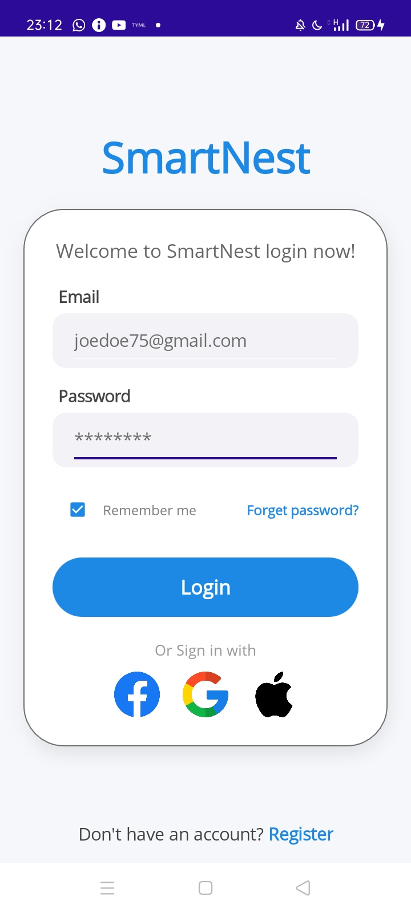
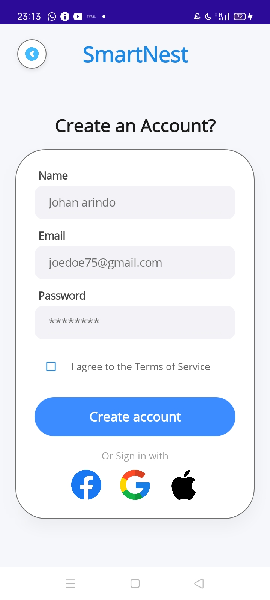
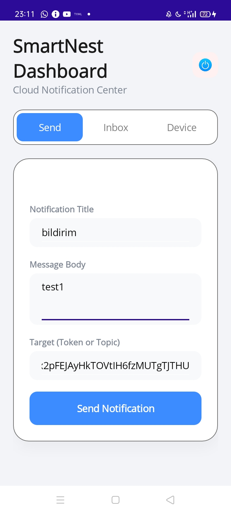
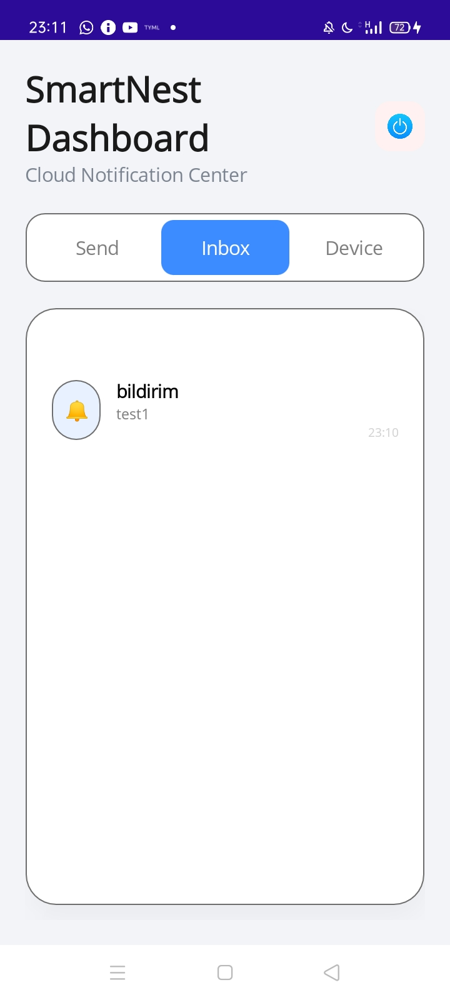
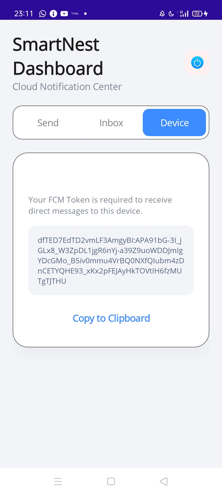

MAUI Firebase Auth & Push Notification Demo
Bu proje, .NET MAUI platformu üzerinde modern bir mobil uygulama deneyimi sunmak amacıyla geliştirilmiştir. Uygulama, Firebase ekosistemi ile tam entegre çalışarak Kimlik Doğrulama (Auth), Firestore Veri Yönetimi ve Bulut Bildirimleri (FCM V1) süreçlerini uçtan uca yönetmektedir.
🚀 Ön Gereksinimler (Prerequisites)
Visual Studio 2022 (v17.8 veya üzeri önerilir)
.NET MAUI Workload (v8.0)
Android SDK 34 (API 34) ve üzeri
Firebase Projesi: Aktif bir Firebase projesi ve google-services.json dosyası.
📸 Ekran Görüntüleri
1. Kimlik Doğrulama Akışı
Hoşgeldiniz (Landing)	Giriş Yap (Login)	Kayıt Ol (Register)
		
2. Dashboard (3 Sekmeli Yönetim Paneli)
Sekme 1: Bildirim Gönder	Sekme 2: Gelen Kutusu	Sekme 3: Cihaz Token
		
💻 Kritik Teknik Çözümler
1. Güvenli Bildirim Gönderimi (FCM V1 & OAuth2)
Uygulama, eski Legacy API yerine Google'ın güncel FCM V1 protokolünü kullanır. Uygulama içinden bildirim tetiklemek için Google.Apis.Auth kütüphanesi ile Service Account üzerinden geçici Access Token üretilir:
code
C#
// OAuth2 Access Token Üretimi (FCM V1 Yetkilendirme)
var credential = GoogleCredential.FromJson(jsonContent)
                 .CreateScoped("https://www.googleapis.com/auth/firebase.messaging");
var accessToken = await credential.UnderlyingCredential.GetAccessTokenForRequestAsync();

// FCM V1 Payload Gönderimi
using (var client = new HttpClient())
{
    client.DefaultRequestHeaders.Authorization = new AuthenticationHeaderValue("Bearer", accessToken);
    var response = await client.PostAsync(fcmV1Url, new StringContent(jsonPayload, Encoding.UTF8, "application/json"));
}
2. Dinamik Bildirim Listeleme (Inbox)
Gelen bildirimler, uygulama açıkken (Foreground) NotificationReceived eventi ile yakalanır ve arayüzdeki ObservableCollection listesine anlık yansıtılır:
code
C#
CrossFirebaseCloudMessaging.Current.NotificationReceived += (s, e) => {
    MainThread.BeginInvokeOnMainThread(() => {
        Notifications.Insert(0, new ReceivedNotification {
            Title = e.Notification.Title,
            Body = e.Notification.Body,
            ReceivedTime = DateTime.Now.ToString("HH:mm")
        });
    });
};
🛠️ Kurulum ve Yapılandırma (Case Maddeleri)
1. Firebase Kurulumu
Android: google-services.json dosyası Platforms/Android/ altına eklenmiş ve Build Action GoogleServicesJson olarak ayarlanmıştır.
Asset: service-account.json dosyası Resources/Raw/ altına eklenerek FCM gönderimi için yetkilendirme sağlanmıştır.
2. Authentication Akışı
Süreç: Kullanıcı kayıt olduğunda Firebase Auth üzerinde hesap açılır ve ek bilgileri Firestore'da saklanır.
Oturum Yönetimi: Preferences kullanılarak "Beni Hatırla" özelliği (Auto-login) entegre edilmiştir. Uygulama açılışında geçerli bir token varsa kullanıcı Dashboard'a otomatik yönlendirilir.
3. Bildirim Gönderme Mantığı (Topic / Token)
Dashboard üzerindeki yönetim panelinden iki farklı hedefleme yapılabilir:
Topic: "news" gibi belirli bir konuya abone olan tüm kullanıcılara toplu mesaj.
Token: Sadece belirli bir cihaza özel, manuel token girişi ile bireysel mesaj.
4. Kullanılan Paketler
Plugin.Firebase (Auth, Firestore, Messaging)
Google.Apis.Auth (OAuth2/FCM V1)
CommunityToolkit.Maui (Modern UI Bileşenleri)
Xamarin.AndroidX.Lifecycle (Sürüm çakışmalarını gidermek için 2.8.3.1 sürümüyle sabitlendi)
5. Bilinen Eksikler ve İyileştirmeler
Güvenlik: Service Account anahtarı test kolaylığı için uygulama içindedir; prodüksiyonda Backend API üzerinden yönetilmelidir.
Splash Screen: Android 12+ üzerindeki sistem önbelleği nedeniyle, bazı cihazlarda görsel varsayılan renkte kalabilmektedir.
Geliştirme: Bildirimler SQLite ile cihazda kalıcı olarak saklanabilir.
Geliştirici: Sultannur KAYA
Teslim Tarihi: 03.02.2026
.NET MAUI v8.0